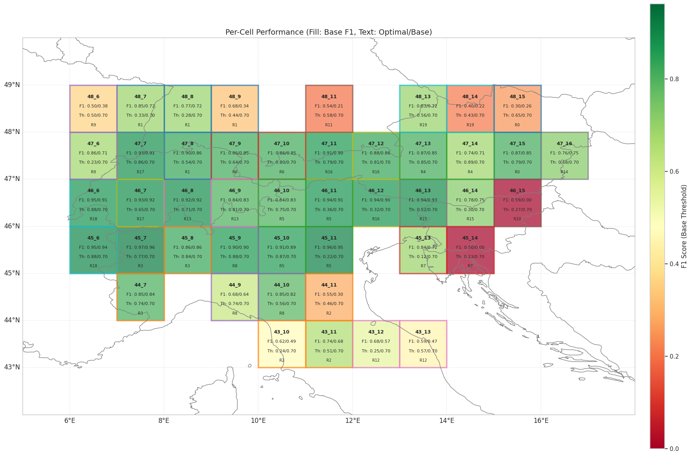

# Paraglideml

[](https://www.python.org/downloads/)
[](https://scikit-learn.org/)
[](https://pytorch.org/)
[](https://opensource.org/licenses/MIT)

Paraglideml forecasts the *cross-country potential* of a paragliding day over the Alps from [GFS](https://www.nco.ncep.noaa.gov/pmb/products/gfs/) weather and historical flights from [XContest](https://www.xcontest.org/).

It does not answer a flat "fly / don't fly". It estimates calibrated, cumulative probabilities over flight-quality tiers, keyed to the realistic XC distance a good pilot could achieve in a 1° cell:

| Tier | Meaning | Probability |
|---|---|---|
| flyable | XC ≥ 15 km — a usable day | `P(≥ flyable)` |
| good | XC ≥ 50 km — a proper XC day | `P(≥ good)` ← headline metric |
| epic | XC ≥ 100 km — a standout day | `P(≥ epic)` |

The tiers are cumulative, so `P(≥flyable) ≥ P(≥good) ≥ P(≥epic)` always holds. Current focus is the Alpine arc (Slovenia, Italy, Austria); the recipe generalises to any mountain or flatland region with flight history.



---

## Why distance, not "go / no-go"

A binary "flyable" label is noisy: a marginal soaring day and a 200 km classic both count as `1`. Targeting the XC distance behind a day turns a fuzzy classification into a graded, ranked signal that pilots actually care about — *how good*, not just *whether*. The model is a panel of calibrated gradient-boosted trees (one per tier) with a monotonicity clamp, so the three probabilities stay consistent and mean what they say.

How it scores (honest protocol, the `good` tier):

- Rolling-origin backtest (fit on prior years, score the next): AP ≈ 0.72, ROC-AUC ≈ 0.89.
- Held-out 2026 season, never seen in training: Spearman of `P(≥good)` against the actual best distance per cell-day ≈ 0.92 — the ranking is what holds up.
- Forecast skew (the real serving condition — see below): scored on GFS *forecast* instead of the *analysis* it trained on, the `good` tier holds AP 0.81 / ROC 0.93 at +1 day and AP 0.73 / ROC 0.90 at +3 days.

The takeaway baked into the product: the ranking survives the forecast to +3 days because the target is *synoptic* (XC potential in a ~100 km cell), not pointwise thermals — so a 3-day outlook is meaningful, with +1 day as the confident headline.

---

## Quick start — inference

The model ships inside the package (calibrated GBM, no PyTorch needed), so a fresh install predicts out of the box.

```bash
pip install 'paraglideml[inference] @ git+https://github.com/Genajoin/paraglideml.git@v0.1.0'
```

Python API (torch-free):

```python
from paraglideml import predict_tiers, tiers_to_geojson

rows = predict_tiers("2026-06-15")          # downloads the GFS slice, scores every cell
# → [{'cell': '46_13', 'lat': 46, 'lon': 13, 'date': '2026-06-15',
#     'lead': 0, 'p_flyable': 1.0, 'p_good': 0.56, 'p_epic': 0.33}, ...]

geojson = tiers_to_geojson(rows, "2026-06-15")   # FeatureCollection of honest 1° squares
```

CLI:

```bash
paraglideml forecast-tiers --date 2026-06-15            # per-cell P(≥flyable/good/epic)
paraglideml forecast-tiers --date 2026-06-15 --geojson out.geojson
```

### Pointing at a fresher model

Inference loads weights from the bundled `exp_056` by default. A production deployment can point at a newer model on disk (synced from object storage, retrained on a cadence) without re-releasing the library — code and weights are decoupled:

```bash
export PARAGLIDEML_MODEL_DIR=/srv/models/exp_latest    # model_{flyable,good,epic}.joblib + calibrator_* + features.txt
export PARAGLIDEML_CELL_TERRAIN=/srv/data/cell_terrain.json     # optional override
export PARAGLIDEML_SELECTED_CELLS=/srv/data/selected_cells.json # optional override
```

See `src/paraglideml/assets.py`. A runnable walkthrough lives in [`notebooks/06_inference_demo.ipynb`](notebooks/06_inference_demo.ipynb).

---

## Serving: forecast → map

The production path emits the artifact the map consumes:

```bash
# Per-cell P(≥flyable/good/epic) for the next 3 days, each scored from its
# forecast lead-time off the run_date 00z GFS cycle → GeoJSON of 1° squares.
paraglideml forecast-window --run-date 2026-06-14 --days 3 --out forecast.geojson
```

```
GFS 00z (byte-range) → paraglideml (features + calibrated GBM) → GeoJSON 1° squares
   → object storage (R2) → Cloudflare Worker → map layer (coloured by P(≥good), date navigator)
```

This is wired into the [FlyBeeper](https://flybeeper.com) live map: a once-a-day pipeline publishes the artifact, a Worker serves it, and a MapLibre layer renders the cells. The 1° granularity (~100 km) is rendered as honest squares — never implying point accuracy. Forecast horizon is 3 days by design (see the scores above; measure it yourself with `paraglideml forecast-skew`).

---

## Train your own model

The project is CLI-first: every operation runs through the `paraglideml` command. Training pulls in the heavy stack via the `[train]` extra (PyTorch, xarray, cartopy, matplotlib).

```bash
git clone https://github.com/Genajoin/paraglideml.git && cd paraglideml
python -m venv .venv && source .venv/bin/activate
pip install -e '.[train]'
paraglideml info                       # show config and paths

# 1. Data
paraglideml data gfs                   # GRIB2 → NPZ cache (135+ params per cell)
paraglideml data flights               # score cells by flight history → selected_cells.json
paraglideml data terrain               # per-cell elevation / slope from FlyBeeper launch sites
paraglideml data build                 # join weather + flights → multicell_dataset.csv

# 2. Train
paraglideml train ordinal              # the product: calibrated cumulative tiers P(≥...)
paraglideml train goodxc               # the distance-based P(good XC day) target
paraglideml train baseline             # gradient-boosted ceiling on the same honest protocol
paraglideml train backtest             # rolling-origin generalisation estimate per year
paraglideml train model                # the earlier MultiRegional neural net (historical)

# 3. Evaluate
paraglideml analyze summary [exp_XXX]  # results + per-cell performance (latest by default)
paraglideml analyze errors  [exp_XXX]  # influential features, neutral zone
paraglideml analyze compare --limit 5  # experiments vs. the baseline

# 4. Measure forecast degradation
paraglideml forecast-skew --start 2026-06-01 --end 2026-06-10 --leads 1 3
```

### Data acquisition

For real training (beyond the bundled example), prepare:

1. Weather (GFS): 0.25° GFS Analysis archives in `.grb2`.
   - Source: [NOAA GFS S3](https://noaa-gfs-bdp-pds.s3.amazonaws.com/) · files `gfsanl_3_YYYYMMDD_HH00_000.grb2`
   - Path: `data/gfs/anl/YYYY-MM/` (configurable in `.env`)
2. Flights (XContest): export flights for your area/period as `.json` into `data/flights/`.

The downloaders from the [PyParaglide](https://github.com/Genajoin/PyParaglide) project can fetch both.

---

## How it works

- Target: XC distance per cell-day → cumulative tiers (15 / 50 / 100 km), trained with confident-learning label cleanup to fight the noise in self-reported flight logs.
- Features: ~50 weather descriptors derived from the GFS profile, plus terrain context per cell (elevation, mountainous-ness, slope orientation) from real FlyBeeper launch sites. GFS wind direction was tested and dropped — too inaccurate at this resolution to add signal honestly.
- Model: three calibrated `HistGradientBoosting` classifiers (one per tier) + isotonic calibration + a monotonicity clamp; lean enough to ship inside the wheel and run torch-free.
- Earlier approach: a PyTorch MultiRegional attention network (regional embeddings + confidence weighting) — kept for the binary `forecast` command and documented in [`docs/multiregional.md`](docs/multiregional.md). The distance-based GBM superseded it for the product.

Full model documentation — features, label cleanup, calibration, scores: [`docs/MODEL.md`](docs/MODEL.md).

---

## Project structure

```
paraglideml/
├── pyproject.toml                # core = lean inference; [train] / [dev] extras
├── README.md
│
├── src/paraglideml/
│   ├── __init__.py               # public API: predict_tiers, forecast_window, tiers_to_geojson, TIERS
│   ├── cli.py                    # Typer CLI entry point
│   ├── config.py                 # configuration (loads .env)
│   ├── tiers.py                  # tier definitions (dependency-free single source of truth)
│   ├── assets.py                 # model/data resolver (bundled default ↔ $PARAGLIDEML_MODEL_DIR)
│   ├── predict.py                # inference: GFS fetch → features → tiers → GeoJSON
│   ├── ordinal.py                # calibrated ordinal-tier training
│   ├── goodxc.py                 # distance-based P(good XC) target
│   ├── baseline.py               # gradient-boosted baseline / ceiling
│   ├── skew.py                   # forecast-vs-analysis degradation measurement
│   ├── multiregional.py          # earlier MultiRegional NN (train path)
│   ├── train.py                  # NN training pipeline
│   │
│   ├── assets/                   # bundled model (exp_056) + cell_terrain.json + selected_cells.json
│   ├── data/                     # gfs_processor, dataset_builder, terrain, weather_cache, ...
│   └── analysis/                 # summary, error_analyzer
│
├── notebooks/                    # 01–05 exploration; 06 inference demo
├── models/experiments/           # training outputs (exp_XXX/)
└── data/                         # gfs/, flights/, processed/
```

---

## Configuration

Paths, date ranges and training parameters live in a `.env` file in the project root (read by `src/paraglideml/config.py`). Inference with the bundled model needs no configuration. Inspect the active config with:

```bash
paraglideml info
```

---

## Development

```bash
pip install -e '.[train,dev]'
black src/ && isort src/
```

---

## License

MIT

---

## Hire me

I take on commercial engineering work through [Alpisto d.o.o.](https://alpisto.eu) (Slovenia, EU) — MATLAB → Python migrations, power-systems algorithms, embedded BLE/RTOS firmware, and IoT backends.

→ [alpisto.eu/matlab-to-python](https://alpisto.eu/matlab-to-python) · gena@alpisto.eu · [LinkedIn](https://www.linkedin.com/in/evgenyistomin/)
