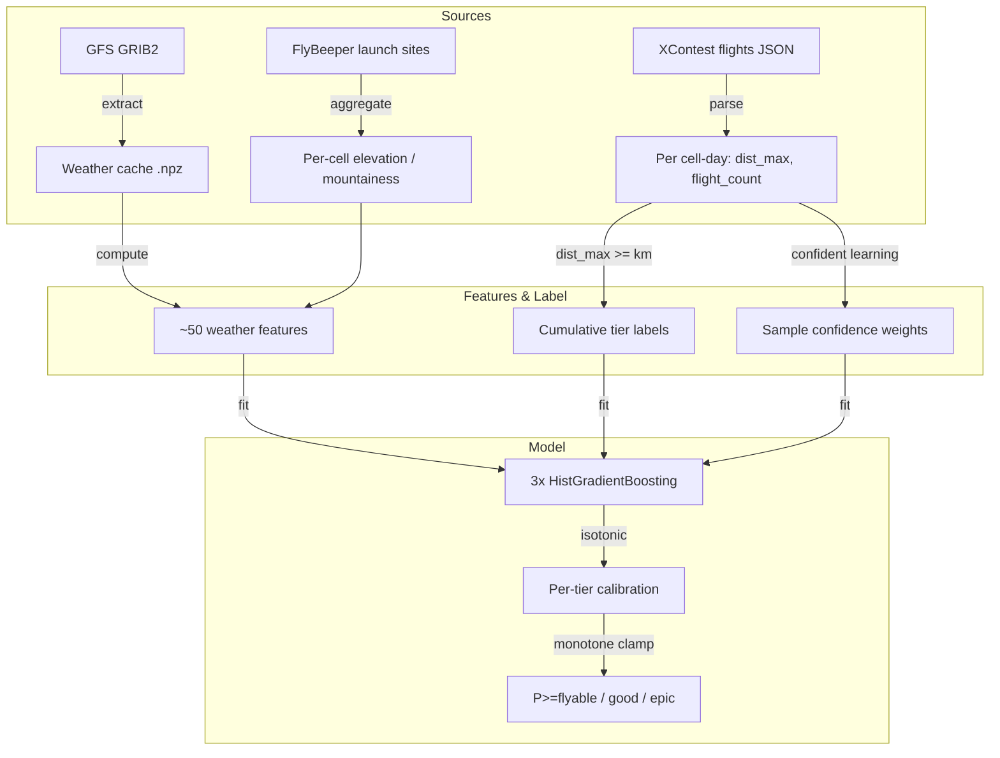

# Paraglideml Model Documentation

*Last Updated: 2026-06-14*

## 1. Overview

Goal: Forecast the cross-country (XC) potential of a paragliding day for a 1° cell over the Alps — not a flat "fly / don't fly", but *how good* the day is likely to be.

Task: Ordinal classification over cumulative, distance-based tiers.

| Tier | Threshold | Output |
|---|---|---|
| flyable | XC ≥ 15 km | `P(≥ flyable)` |
| good | XC ≥ 50 km | `P(≥ good)` ← headline |
| epic | XC ≥ 100 km | `P(≥ epic)` |

The tiers are cumulative (each implies the ones below), so the model guarantees `P(≥flyable) ≥ P(≥good) ≥ P(≥epic)`.

Output: three calibrated probabilities per cell-day. Framework: scikit-learn `HistGradientBoosting` (no PyTorch in the serving path — the model ships inside the wheel and runs torch-free).

> The earlier binary "Go/No-Go" MLP (PyTorch, Macro-F1) is superseded for the product; it survives as the `forecast` command and is documented in [`multiregional.md`](multiregional.md).

## 2. Why distance, not a binary label

`is_flyable = (flight_count >= 1)` conflates a 200 km classic with a 10-minute sled ride — and roughly a third of "flyable" cell-days are local flights (< 30 km). That label noise caps any binary model. Targeting the route distance instead turns a fuzzy class into a graded signal pilots care about, and lets us evaluate with precision-oriented, threshold-free metrics (Average Precision, calibration) — the right fit for a bot/map that surfaces only high-confidence days.

## 3. Data Pipeline



## 4. Target & label cleanup

For each cell-day from the flight logs we derive `dist_max` (best route distance flown in the cell that day) and `flight_count`. The tier label is simply `tier = (dist_max >= threshold_km)`.

To fight the noise in self-reported logs, training uses confident-learning sample weights rather than trusting every label equally:

- Confident good (weight 1.0): the cell hit the tier distance and the surrounding region was broadly good (`≥ BROAD_MIN = 5` cells reached `good` that day) — a real synoptic XC day, not a one-off.
- Confident bad (weight 1.0): zero flights and a quiet region (no good cell) — a confidently down day.
- Ambiguous cell-days (flew locally, or good cell in an otherwise quiet region) are down-weighted, so the model learns from the clear cases.

Regional context (`good cells per region-day`) makes the signal synoptic: it asks "was this a good *region* day", which is exactly what survives into a multi-day forecast.

## 5. Features (52)

The bundled model (`exp_056`) uses the feature set in `src/paraglideml/assets/model/features.txt`. All weather features are derived from the GFS vertical profile so they generalise across terrain elevation.

### 5.1 Surface & near-ground context

| Feature | Definition | Interpretation |
|---|---|---|
| `surface_pressure` | GFS `sp_0sfc` | The terrain anchor (see §6) |
| `temp_2m`, `dewpoint_spread_2m` | 2 m temp, T − Td | Heating / low-level dryness |
| `u_10m`, `v_10m`, `wind_speed_10m`, `gust_10m` | 10 m wind components, speed, gust | Surface wind strength (direction used with care, §7) |
| `total_cloud_cover`, `visibility` | column cloud, visibility | Sky state |

### 5.2 Instability & moisture

| Feature | Interpretation |
|---|---|
| `cape`, `cin` | Convective available energy / inhibition |
| `dps_850`, `dps_700` | Dew-point spread at 850/700 hPa — cloud base / dryness aloft |

### 5.3 Vertical velocity (omega)

| Feature | Interpretation |
|---|---|
| `w_850`, `w_700`, `w_600`, `w_500` | Vertical velocity at pressure levels |
| `omega_low_mean`, `omega_low_min` | Low-level lift/subsidence summary (sinking air kills a day) |

### 5.4 Vertical profile (per-level)

Scanned from 1000 → 500 hPa so the model sees the whole column and finds shear/inversions at any altitude:

- Wind speed: `ws_1000, ws_975, ws_950, ws_925, ws_900, ws_850, ws_800, ws_750, ws_700, ws_600, ws_500`
- Lapse rate (layer gradients): `lr_1000_975, lr_975_950, lr_950_925, lr_925_900, lr_900_850, lr_850_800, lr_800_750, lr_750_700, lr_700_600, lr_600_500`
- Low-level summaries: `wind_speed_850`, `wind_speed_700`, `wind_shear_low` (|V₈₅₀ − V₁₀ₘ|), `lapse_low_mean`

### 5.5 Daily aggregates

The forecast for a day is a profile over hours; these collapse it to what matters for a flying window:

`cape_daymax`, `ws850_daymax`, `ws700_daymax`, `gust_daymax`, `lapse_low_daymax`, `cape_amp` (diurnal CAPE amplitude).

### 5.6 Terrain (per cell)

`elevation`, `mountainess` — see §6.

## 6. Terrain: launch sites, not a DEM

Launch-site locations are known, so terrain features come from real FlyBeeper spot files rather than sampling a DEM raster:

- `elevation` — median altitude of the cell's launch sites (real launch heights, not the GFS cell-mean which smooths the Alps flat).
- `mountainess` — altitude spread `(p90 − p10)/1000` of the cell's sites, clamped — a relief proxy.

### The surface-pressure anchor & underground levels

GFS at 0.25° smooths terrain heavily, so `surface_pressure` is the crucial anchor telling the model where the real ground is:

- *Kobala (1080 m):* GFS sees the surface near ~1005 hPa (~100 m ASL).
- *Marmolada (3343 m):* GFS sees the surface near ~910 hPa (~1000 m ASL).

GFS also provides extrapolated (non-zero) values for T/U/V at pressure levels *below* the model's surface. For Marmolada, levels 1000–925 hPa are "underground" yet carry valid extrapolated data. The model therefore receives the full vertical profile plus `surface_pressure`, and learns to (1) locate the real ground via `sp_0sfc`, (2) detect shear/inversions anywhere in the column, (3) generalise across plains vs. high Alps.

## 7. A note on wind direction

A physical `slope_wind_alignment` feature was built (per-cell 8-way launch orientations from `takeoff.geojson` / `dhv` direction tokens, scored against forecast wind) — see `src/paraglideml/data/terrain.py`. It was tested and dropped from the production feature set: GFS wind direction is too inaccurate at this resolution, and many launches are sheltered by terrain behind them, so the score added noise rather than signal. Only `elevation` and `mountainess` survive into the model; the orientation machinery is retained for future use.

## 8. Model architecture

Three independent calibrated cumulative-tier classifiers:

```
for tier in (flyable, good, epic):
    clf = HistGradientBoostingClassifier(
        learning_rate=0.05, max_iter=400, max_leaf_nodes=31, l2_regularization=1.0
    )                                              # fit on sample weights (§4)
    iso = IsotonicRegression(out_of_bounds="clip") # calibrate on the most recent year
# enforce monotonicity on calibrated probs: P(>=flyable) >= P(>=good) >= P(>=epic)
```

- Calibration: isotonic regression, fit on the most recent year as a held-out slice, so the probabilities are honest (a "60%" means 60%).
- Monotonicity clamp: after calibration, clamp each cell-day so the cumulative ordering holds (~11% of cell-days needed clamping in `exp_056`).
- Deployment: the trio + calibrators (`model_{flyable,good,epic}.joblib`, `calibrator_*.joblib`, `features.txt`, `region_mapping.json`) is bundled in the wheel and resolved via `paraglideml.assets` (override with `$PARAGLIDEML_MODEL_DIR`).

## 9. How well it works (honest protocol)

The in-sample metrics in `assets/model/config.json` (good: AP 0.91 / ROC 0.96) are optimistic — no holdout. The honest numbers come from `paraglideml train backtest` (rolling-origin: fit on prior years, score the next) and a held-out season:

| Measure | `good` tier |
|---|---|
| Rolling-origin backtest | AP ≈ 0.72, ROC-AUC ≈ 0.89 |
| Held-out 2026 (Spearman of `P(≥good)` vs. actual best distance) | ≈ 0.92 |

Ranking is what holds up — the calibrated probability orders cell-days correctly even on a season never seen in training.

## 10. Serving & forecast horizon

The model trained on GFS analysis (`f000`); in production it is fed GFS forecast lead-times. `paraglideml forecast-skew` measures the gap on the same cell-days. For the `good` tier:

| Lead | AP | ROC-AUC |
|---|---|---|
| +1 day | ~0.81 | ~0.93 |
| +3 days | ~0.73 | ~0.90 |

The ranking survives to +3 days because the target is *synoptic* (XC potential in a ~100 km cell), not pointwise convection. Hence the product horizon is 3 days, with +1 day as the confident headline. `forecast-window` emits the per-cell, per-day GeoJSON artifact (1° squares) that feeds the map; recalibration is monotone and can only fix Brier, not the ranking, so a full forecast-aware rebuild was judged poor ROI.
