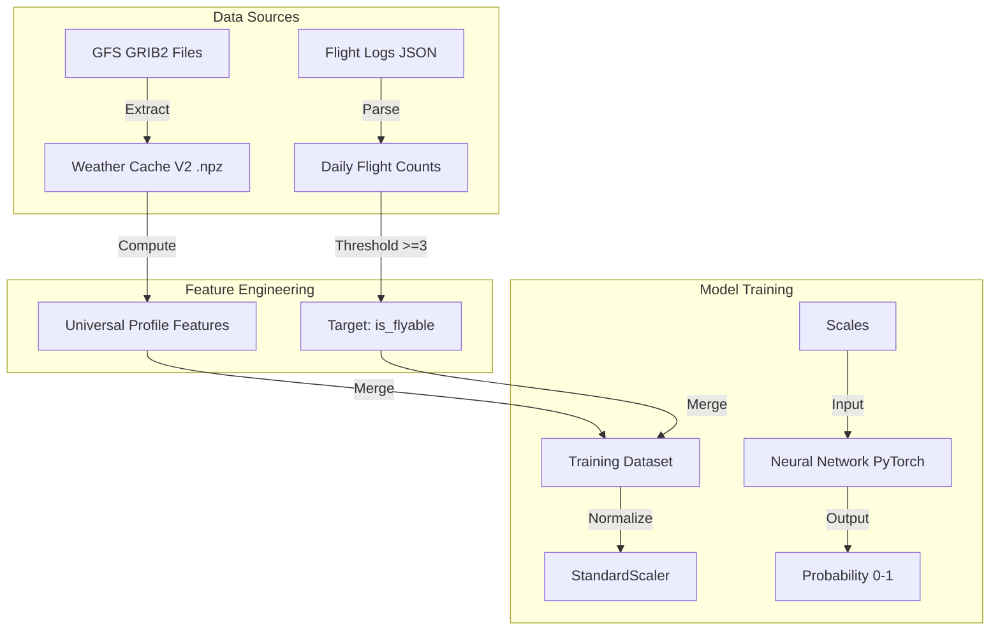

# Paraglideml Model Documentation

*Last Updated: 2026-01-10*

## 1. Overview
**Goal:** Predict paragliding flyability (Go/No-Go) for a specific location. The current focus is Kobala (Slovenia), but the model is being architected to be **universal** (Alpine and Flatland sites).
**Task:** Binary Classification.
**Target Metric:** Macro F1-Score (balance between catching flyable days and safety).

## 2. Data Pipeline

## 3. Features

### Raw Inputs (from GFS GRIB2)

| Feature Key | Description | Level | Units |
|-------------|-------------|-------|-------|
| `t_{P}hPa` | Temperature | Isobaric (1000-200 hPa) | K |
| `gh_{P}hPa` | Geopotential Height | Isobaric | gpm |
| `r_{P}hPa` | Relative Humidity | Isobaric | % |
| `u_{P}hPa`, `v_{P}hPa`| Wind Components | Isobaric | m/s |
| `10u_10m`, `10v_10m` | Surface Wind (10m) | 10m Above Ground | m/s |
| `sp_0sfc` | **Surface Pressure** | Surface | Pa |
| `2t_2m` | 2m Temperature | 2m Above Ground | K |
| `cape_0sfc` | CAPE | Surface | J/kg |
| `cin_0sfc` | Convective Inhibition | Surface | J/kg |
| `tcc_0atm` | Total Cloud Cover | Atmosphere | % |

### Derived & Context Features (Computed in `WeatherCache`)
Calculated to provide a vertical profile regardless of terrain elevation.

| Feature Name | Definition / Formula | Interpretation | Units |
|--------------|----------------------|----------------|-------|
| **Lapse Rate Profile** | `lr_{P1}_{P2}` | Gradient between layers (1000-500hPa) | deg/km |
| **Wind Speed Profile** | `ws_{P}` | Wind speed at every level (1000-500hPa) | m/s |
| **Surface Context** | `surface_pressure`, `temp_2m` | "Anchor" to help model find the ground | Pa, K |
| **Wind Speed 10m** | `sqrt(u10^2 + v10^2)` | Surface wind strength | m/s |
| **Wind Shear Low** | `|Vec_Wind_850 - Vec_Wind_10m|` | Turbulence risk near ground (Legacy/Bulk) | m/s |
| **DPS 850/700** | `(100 - RH) / 5.0` | Dew Point Spread (dryness/cloud base) | deg C |

### Data Details: Underground Levels & Orography
*   **Surface Pressure (`sp_0sfc`):** This is the crucial "Anchor". GFS grid (0.25°) smooths terrain significantly.
    *   *Example (Kobala, 1080m):* GFS sees surface at ~1005 hPa (~100m ASL).
    *   *Example (Marmolada, 3343m):* GFS sees surface at ~910 hPa (~1000m ASL).
*   **Underground Extrapolation:** GFS provides valid (extrapolated) values for T, U, V even for pressure levels *below* the surface.
    *   *Marmolada Analysis:* Levels 1000, 975, 950, 925 hPa are "BELOW Ground" (P_level > 910 hPa) but contain data (e.g., extrapolated Temp ~287K). These are **not zero**.
*   **Model Strategy:** The model receives the full vertical profile (Wind & Lapse Rate) + `surface_pressure`. It learns to:
    1. Identify the "real" ground via `sp_0sfc`.
    2. Detect wind shear or inversions at *any* altitude by scanning the profile.
    3. Generalize across different terrains (Plains vs High Alps).

## 4. Model Architecture

**Type:** Feed-Forward Neural Network (MLP)
**Framework:** PyTorch

*   **Input Layer:** Universal Weather Profile (Gradients + Wind Profile + Surface Context).
*   **Hidden Layers:**
    *   Linear(64) + ReLU + Dropout(0.3)
    *   Linear(32) + ReLU + Dropout(0.3)
    *   Linear(16) + ReLU
*   **Output Layer:** Linear(1) + Sigmoid

## 5. Current Issues & Roadmap

1.  **Universal Model Transition:** (Completed) `WeatherCache` now provides full vertical profiles for Lapse Rate and Wind Speed.
2.  **Wind Anomalies:** GFS 10m wind shows 16-20 m/s (storm force) at Kobala. **Status:** Model will use the full profile to find "true" wind, potentially ignoring the noisy 10m layer if it contradicts upper levels.
3.  **False Positives:** Model is over-optimistic on moist days. **Action:** Train new model with these expanded features (DPS + Cloud Cover are already included).
